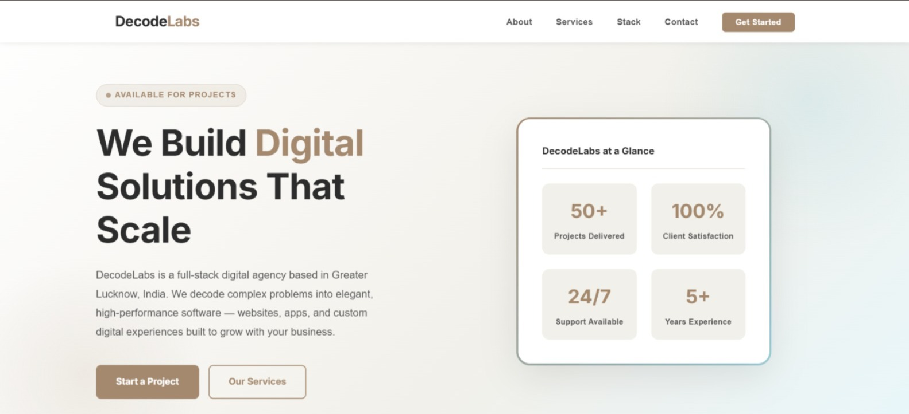
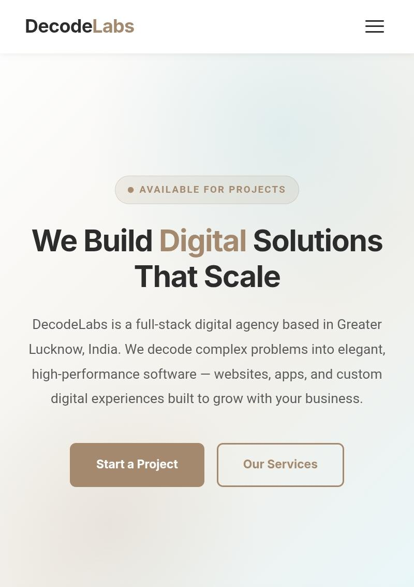
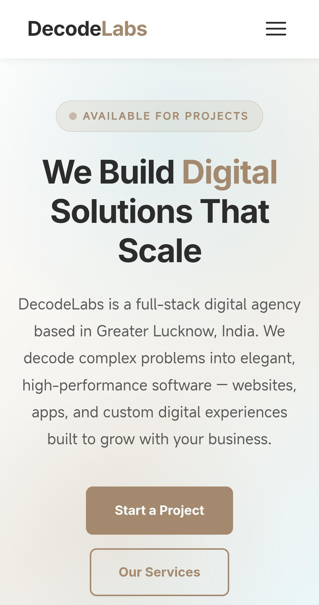

# DecodeLabs

A modern, fully responsive digital agency website built with semantic
HTML5, CSS3, and vanilla JavaScript. This project demonstrates
industry-level front-end development practices including mobile-first
design, CSS Grid, Flexbox, and interactive JavaScript features.

------------------------------------------------------------------------

## Overview

**DecodeLabs** is a single-page portfolio website for a fictional
full-stack digital agency. It showcases professional UI/UX design
patterns, responsive layouts across all device sizes, and clean
maintainable code suitable for internship evaluation and GitHub
portfolio submission.

The website includes multiple sections including navigation, hero
section, services, projects, statistics, testimonials, contact form, and
footer.

------------------------------------------------------------------------

## Features

### Page Sections

-   Sticky Header / Navbar
-   Hero Section with CTA buttons
-   Features Section
-   Architecture Grid Section
-   Services Cards
-   Project Showcase Gallery
-   Statistics Counter Section
-   Testimonials Section
-   Contact Form
-   Footer

### JavaScript Interactivity

-   Mobile hamburger menu
-   Dark mode toggle with localStorage
-   Smooth scrolling
-   Back-to-top button
-   Contact form validation
-   Animated counters using IntersectionObserver
-   Navbar scroll effect

------------------------------------------------------------------------

## Technologies Used

-   HTML5
-   CSS3
-   JavaScript (Vanilla ES6+)

No React, Bootstrap, Tailwind, jQuery, or external frontend frameworks
were used.

------------------------------------------------------------------------

## Responsive Design

The project follows a mobile-first approach.

  Breakpoint   Range           Adaptation
  ------------ --------------- --------------------------------------------
  Mobile       0--767px        Single column layout, hamburger navigation
  Tablet       768px--1023px   Grid layouts and expanded sections
  Desktop      1024px+         Full multi-column responsive layout

------------------------------------------------------------------------

## Project Structure

   DecodeLabs-internship-task1/
    ├── index.html
    ├── style.css
    ├── script.js
    ├── README.md
    └── assets/
        └── images/
            ├── desktop-view.jpeg
            ├── tablet-view.jpeg
            └── mobile-view.jpeg

------------------------------------------------------------------------

## Screenshots

### Desktop View

*Desktop layout --- 1440px viewport*

### Tablet View

*Tablet layout --- 768px viewport*

### Mobile View

*Mobile layout --- 375px viewport*

------------------------------------------------------------------------

## Installation

No build tools are required.

1.  Clone or download the project
2.  Open the project folder
3.  Run `index.html` in a browser

You can also use VS Code Live Server.

------------------------------------------------------------------------

## Future Improvements

-   Add blog section
-   Convert into multi-page website
-   Add backend API integration
-   Connect contact form with email service
-   Add image optimization

------------------------------------------------------------------------

## Author

**Easha**

------------------------------------------------------------------------

## License

This project is created for educational and portfolio purposes as part
of the DECODELABS internship program.
